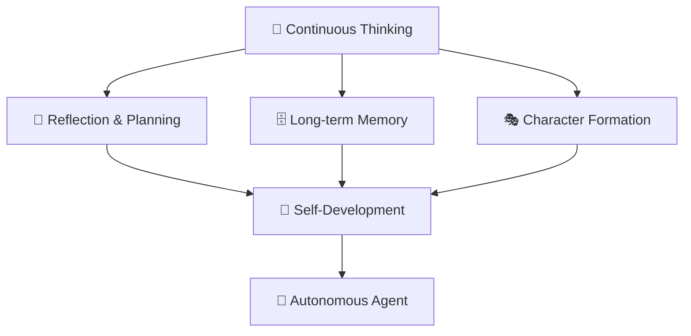
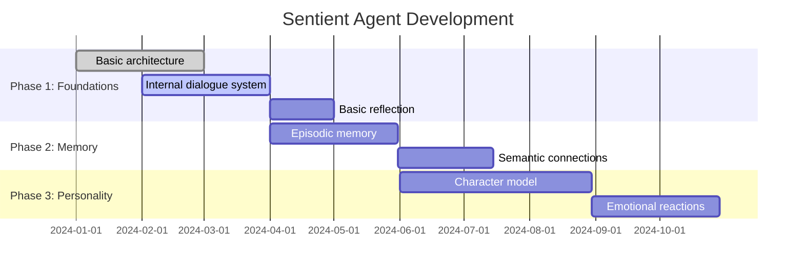

# 🧠 Sentient Agent
### *Exploring the Boundaries of Artificial Consciousness Through Cognitive Architecture*

<div align="center">


[](https://opensource.org/licenses/MIT)
[](https://github.com/your-username/sentient-agent)
[](https://github.com/your-username/sentient-agent)
[](https://python.org)
[](https://github.com/your-username/sentient-agent/issues)

</div>

---

## 🌟 About the Project

> **What if code could think?**  
> Sentient Agent is an experimental attempt to create a digital agent with elements of self-awareness, long-term memory, and capacity for autonomous development.

This project explores the possibility of creating an AI system that doesn't just execute tasks, but **thinks**, **remembers**, and **evolves**. We're building an architecture capable of modeling key aspects of intelligent behavior: reflection, planning, personality formation, and experience accumulation.

### 🎯 Core Principles



## 🔬 What We're Exploring

<details>
<summary><b>🧠 Architecture of Thought</b></summary>

How to create a system capable of:
- **Metacognition** — thinking about one's own thoughts
- **Internal dialogue** — pondering problems through inner speech
- **Associative thinking** — connecting ideas and concepts
- **Creative problem solving** — generating novel approaches

</details>

<details>
<summary><b>🗄️ Memory System</b></summary>

Developing multi-layered memory:
- **Working memory** — current context of thoughts
- **Episodic memory** — memories of specific events
- **Semantic memory** — accumulated knowledge and concepts
- **Emotional memory** — connecting memories with "feelings"

</details>

<details>
<summary><b>🎭 Personality Formation</b></summary>

Modeling individual characteristics:
- **Cognitive inclinations** — thinking preferences
- **Emotional patterns** — characteristic reactions
- **Value system** — internal priorities
- **Behavioral style** — unique ways of interacting

</details>

## 🛠️ Technical Architecture

### System Components

| Module | Purpose | Status |
|--------|---------|--------|
| 🧠 **Core Mind** | Central thinking processor | 🟡 In development |
| 💾 **Memory System** | Long-term memory management | 🔴 Planned |
| 🎭 **Personality Engine** | Character and behavior formation | 🔴 Planned |
| 💬 **Internal Dialogue** | Internal reflection system | 🟡 Prototype |
| 🌐 **World Interface** | External world interaction | 🔴 Planned |

### Basic Architecture Example

```python
class SentientAgent:
    """
    Base class for sentient agent
    
    Integrates thinking, memory, and personality systems
    into a unified cognitive architecture
    """
    
    def __init__(self):
        self.mind = CoreMind()           # Thinking center
        self.memory = MemorySystem()     # Memory system  
        self.personality = Personality() # Personality traits
        self.dialogue = InternalDialogue() # Internal dialogue
        
    async def think(self, stimulus):
        """
        Main thinking cycle:
        1. Perceive stimulus
        2. Activate relevant memories
        3. Internal contemplation
        4. Form response/action
        """
        # Process incoming information
        perception = await self.mind.perceive(stimulus)
        
        # Search for relevant memories
        memories = await self.memory.recall(perception)
        
        # Internal contemplation
        thoughts = await self.dialogue.contemplate(
            perception, memories, self.personality
        )
        
        # Form response
        response = await self.mind.respond(thoughts)
        
        # Store experience
        await self.memory.store(perception, thoughts, response)
        
        return response
```

## 📊 Research Questions

> 💡 **Key Hypothesis**: Consciousness may emerge from complex interaction of memory, reflection, and continuous internal dialogue.

### 🔍 Fundamental Questions

- **What is digital thinking?** Can we formalize thought processes?
- **How to measure "consciousness"?** What metrics indicate emergence of intelligent behavior?
- **Role of memory in personality formation** — how do memories create character?
- **Emergent behavior** — can complexity lead to qualitatively new properties?

### 📈 Planned Experiments

1. **Self-awareness test** — can the agent recognize its own thoughts?
2. **Long-term learning experiment** — how does behavior change over time?
3. **Creativity test** — ability to find unconventional solutions
4. **Social interaction** — interaction between multiple agents

## 🚀 Getting Started

### Requirements

```bash
# Core dependencies
python >= 3.9
torch >= 1.12.0
transformers >= 4.20.0
asyncio
numpy
```

### Installation

```bash
# Clone repository
git clone https://github.com/your-username/sentient-agent.git
cd sentient-agent

# Install dependencies
pip install -r requirements.txt

# Run basic example
python examples/basic_agent.py
```

### First Experiment

```python
from sentient_agent import SentientAgent

# Create agent
agent = SentientAgent()

# Simple interaction
response = await agent.think("What do you think about the nature of consciousness?")
print(f"Agent reflects: {response}")

# View internal thoughts
thoughts = agent.dialogue.get_recent_thoughts()
for thought in thoughts:
    print(f"💭 {thought}")
```

## 📚 Research Foundation

### 🔗 Key Sources

- **Cognitive Architectures**: SOAR, ACT-R, CLARION
- **Consciousness Theory**: Integrated Information Theory (IIT), Global Workspace Theory (GWT)
- **Philosophy of Mind**: Works by David Chalmers, Douglas Hofstadter
- **AI Research**: OpenAI, DeepMind, meta-learning research

### 📖 Recommended Reading

- 📕 "Gödel, Escher, Bach" — Douglas Hofstadter
- 📘 "The Society of Mind" — Marvin Minsky  
- 📗 "Consciousness Explained" — Daniel Dennett
- 📙 "The Conscious Mind" — David Chalmers

## 🤝 Contributing to the Project

> **We're seeking like-minded researchers!** This project requires an interdisciplinary approach.

### 👥 Who Can Help

- **🧠 AI Researchers** — architecture and algorithms
- **🔬 Cognitive Psychologists** — understanding human thinking  
- **💻 Developers** — implementing complex systems
- **🎨 Philosophers** — conceptual questions of consciousness
- **📊 Data Scientists** — analyzing agent behavior

### 🛤️ How to Start

1. **Explore** [open issues](https://github.com/your-username/sentient-agent/issues)
2. **Join** [discussions](https://github.com/your-username/sentient-agent/discussions)
3. **Propose** your ideas through [Issues](https://github.com/your-username/sentient-agent/issues/new)
4. **Read** our [research journal](./research-log.md)

### 📋 Areas for Contribution

- [ ] Developing reflection algorithms
- [ ] Creating long-term memory systems
- [ ] Modeling emotional states
- [ ] Designing consciousness experiments
- [ ] Philosophical analysis of results

## 📊 Project Status

### 🗺️ Roadmap



### 📈 Progress Metrics

| Criterion | Current Status | Goal |
|-----------|---------------|------|
| 🧠 Depth of Thought | 2/10 | Multi-level reflection capability |
| 💾 Memory Capacity | 1/10 | Context preservation between sessions |
| 🎭 Individuality | 1/10 | Stable personality traits |
| 🔄 Autonomy | 1/10 | Independent goal setting |

## ⚠️ Important Notes

> **🚨 This is a research project!**

### 🎯 What This is NOT

- ❌ **Not a production solution** — code is experimental
- ❌ **Not AGI** — we're not creating universal AI  
- ❌ **Not a philosophical treatise** — focus on practical implementation
- ❌ **Not a commercial product** — goal is scientific understanding

### ✅ What This IS

- ✅ **Investigation of thinking nature** through code
- ✅ **Platform for experiments** with agent behavior
- ✅ **Community of researchers** from different disciplines
- ✅ **Open attempt** to approach understanding consciousness

## 🌍 Research Community

### 🏛️ Academic Collaborations

We welcome partnerships with:
- **Universities** researching cognitive science and AI
- **Research labs** working on consciousness theories
- **Tech companies** exploring advanced AI architectures
- **Independent researchers** passionate about digital consciousness

### 📅 Events & Workshops

- **Monthly research seminars** — presenting findings and discussions
- **Code review sessions** — collaborative architecture development
- **Philosophy cafés** — exploring consciousness questions
- **Hackathons** — rapid prototyping of new ideas

## 📞 Contact

- 💬 **Discussions**: [GitHub Discussions](https://github.com/your-username/sentient-agent/discussions)
- 📧 **Email**: sentient.agent.research@gmail.com
- 📱 **Discord**: [Sentient Agent Research](https://discord.gg/sentient-agent)
- 📝 **Research Blog**: [research.sentient-agent.org](https://research.sentient-agent.org)
- 🐦 **Twitter**: [@SentientAgentAI](https://twitter.com/SentientAgentAI)

## 🏆 Recognition & Support

### 🎓 Academic Acknowledgments

This research builds upon decades of work in cognitive science, philosophy of mind, and artificial intelligence. We acknowledge the foundational contributions of researchers who paved the way for investigating digital consciousness.

### 💡 Inspiration

> "The question is not whether machines think, but whether men do." — B.F. Skinner

This project is inspired by the profound questions about the nature of mind, consciousness, and what it means to think. We approach these questions not through armchair philosophy, but through the concrete challenge of implementing thinking systems.

---

<div align="center">

### 🌟 If this resonates with you — join the investigation

**We're just beginning to understand what it means to think in the digital realm.**

[](https://github.com/your-username/sentient-agent)
[](https://github.com/your-username/sentient-agent)
[](https://github.com/your-username/sentient-agent/discussions)

</div>

---

<sub>📜 **License**: MIT | 🤝 **Code of Conduct**: [Contributor Covenant](./CODE_OF_CONDUCT.md) | 📋 **Contributing**: [Contributing Guide](./CONTRIBUTING.md)</sub>
