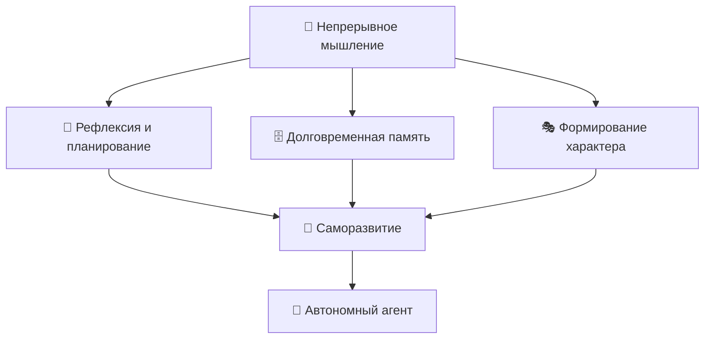
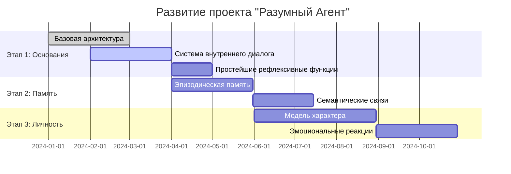

<div align="center">

# 🧠 Эксперимент "Разумный Агент"
### *Исследование границ искусственного сознания через когнитивную архитектуру*

[](LICENSE)
[](https://python.org)
[](https://github.com/your-username/sentiment-agent)
[](https://github.com/your-username/sentiment-agent)
[](CONTRIBUTING.ru.md)

[📖 Документация](docs/) • [🔬 Эксперименты](experiments/) • [💬 Обсуждения](https://github.com/your-username/sentiment-agent/discussions) • [🤝 Участие в проекте](CONTRIBUTING.ru.md)

</div>

<div align="center">
  
</div>

## 📖 Описание исследования

Данный проект представляет собой экспериментальную попытку создания цифрового агента с элементами самосознания, способного к формированию долговременной памяти и автономному развитию личности.

```python
from sentiment_agent import SentimentAgent

# Создание агента
agent = SentimentAgent()

# Философский диалог
response = await agent.think("Что вы думаете о природе сознания?")
print(f"Агент отвечает: {response}")
```

## 🗂 Структура проекта
```
sentiment-agent-exp/
├── assets/
│   └── img/
│       ├── banner.png
│       └── logo-agent.png
├── src/
│   ├── agent.py
│   └── utils.py
├── docs/
│   └── api.md
├── README.md
└── README.ru.md
```

**Основные направления исследования:**
- **🧠 Метакогниция** — способность к рефлексии о собственных мыслительных процессах
- **🗄️ Долговременная память** — накопление и интеграция опыта между сессиями взаимодействия
- **🎭 Формирование личности** — развитие устойчивых индивидуальных характеристик
- **🌱 Саморазвитие** — автономное совершенствование когнитивных способностей

[📖 Подробнее о проекте](#подробное-описание) • [🚀 Установка](#установка) • [🤝 Участие в исследовании](#участие-в-исследовании)

---

## 🌟 О проекте

> **Может ли код обладать сознанием?**  
> Проект "Разумный Агент" — это экспериментальная попытка создания цифровой сущности с элементами самосознания, долговременной памятью и способностью к автономному развитию.

Данное исследование направлено на изучение возможности создания искусственной системы, которая не просто выполняет задачи, но **мыслит**, **запоминает** и **эволюционирует**. Мы разрабатываем архитектуру, способную моделировать ключевые аспекты разумного поведения: рефлексию, планирование, формирование личности и накопление опыта.

### 🎯 Фундаментальные принципы

Наш подход основывается на интеграции классических представлений о структуре психики с современными возможностями вычислительных систем:



## 🔬 Предмет исследования

### Теоретические основания

Проект опирается на фундаментальные работы отечественной и зарубежной психологической науки. Мы интегрируем идеи культурно-исторической теории развития психики Л.С. Выготского с современными представлениями о когнитивных архитектурах, разрабатываемых в области искусственного интеллекта.

<details>
<summary><b>🧠 Архитектура мышления</b></summary>

Исследование возможности создания системы, способной к:
- **Метакогнитивным процессам** — рефлексии о собственных мыслительных операциях
- **Внутреннему диалогу** — обдумыванию проблем через внутреннюю речь в духе концепций А.Р. Лурии
- **Ассоциативному мышлению** — установлению связей между идеями и концептами
- **Творческому решению задач** — генерации новых подходов к проблемным ситуациям

</details>

<details>
<summary><b>🗄️ Система памяти</b></summary>

Разработка многоуровневой архитектуры памяти, основанной на нейропсихологических исследованиях:
- **Рабочая память** — текущий контекст мыслительных операций
- **Эпизодическая память** — воспоминания о конкретных событиях и взаимодействиях
- **Семантическая память** — накопленные знания и понятийные структуры
- **Эмоциональная память** — связывание воспоминаний с аффективными состояниями

</details>

<details>
<summary><b>🎭 Формирование личности</b></summary>

Моделирование процессов становления индивидуальности в цифровой среде:
- **Когнитивные склонности** — устойчивые предпочтения в способах мышления
- **Эмоциональные паттерны** — характерные способы реагирования на различные стимулы
- **Ценностная система** — внутренние приоритеты и предпочтения
- **Поведенческий стиль** — уникальные способы взаимодействия с окружающей средой

</details>

## 🛠️ Техническая архитектура

### Компоненты системы

| Модуль | Назначение | Статус разработки |
|--------|-----------|-------------------|
| 🧠 **Центральный процессор мышления** | Обработка информации и принятие решений | 🟡 В разработке |
| 💾 **Система памяти** | Управление долговременным хранением опыта | 🔴 Планируется |
| 🎭 **Движок личности** | Формирование характера и поведенческих паттернов | 🔴 Планируется |
| 💬 **Внутренний диалог** | Система рефлексивного мышления | 🟡 Прототип |
| 🌐 **Интерфейс взаимодействия** | Коммуникация с внешним миром | 🔴 Планируется |

### Пример базовой архитектуры

```python
class SentimentAgent:
    """
    Базовый класс разумного агента
    
    Интегрирует системы мышления, памяти и личности в единую
    когнитивную архитектуру, основанную на принципах деятельностного
    подхода в психологии
    """
    
    def __init__(self):
        self.mind = CoreMind()           # Центр мыслительной деятельности
        self.memory = MemorySystem()     # Система памяти  
        self.personality = Personality() # Личностные характеристики
        self.dialogue = InternalDialogue() # Внутренний диалог
        
    async def think(self, stimulus):
        """
        Основной цикл мыслительной деятельности:
        1. Восприятие и анализ входящего стимула
        2. Активация релевантных элементов памяти
        3. Внутреннее размышление и рефлексия
        4. Формирование осознанного ответа
        """
        # Обработка входящей информации
        perception = await self.mind.perceive(stimulus)
        
        # Поиск и активация релевантных воспоминаний
        memories = await self.memory.recall(perception)
        
        # Внутреннее размышление
        thoughts = await self.dialogue.contemplate(
            perception, memories, self.personality
        )
        
        # Формирование ответной реакции
        response = await self.mind.respond(thoughts)
        
        # Сохранение опыта для будущего использования
        await self.memory.store(perception, thoughts, response)
        
        return response
```

## 📊 Исследовательские вопросы

> 💡 **Центральная гипотеза**: Сознание может возникнуть из сложного взаимодействия памяти, рефлексии и непрерывного внутреннего диалога в рамках цифровой когнитивной архитектуры.

### 🔍 Фундаментальные проблемы

- **Природа цифрового мышления**: Возможно ли формализовать процессы мышления в вычислительных терминах?
- **Критерии сознательности**: Какие показатели указывают на возникновение разумного поведения в искусственных системах?
- **Роль памяти в становлении личности**: Каким образом воспоминания формируют устойчивые характеристики субъекта?
- **Эмерджентные свойства**: Может ли сложность архитектуры привести к качественно новым когнитивным способностям?

### 📈 Планируемые эксперименты

1. **Тест на самосознание** — способность агента к распознаванию собственных мыслительных процессов
2. **Эксперимент с долговременным обучением** — исследование изменений поведения во времени
3. **Тест на креативность** — способность к нестандартным решениям задач
4. **Социальное взаимодействие** — изучение коммуникации между несколькими агентами

## 🚀 Начало работы с системой

### Системные требования

```bash
# Основные зависимости
python >= 3.9
torch >= 1.12.0
transformers >= 4.20.0
asyncio
numpy
```

### Процедура установки

```bash
# Клонирование репозитория
git clone https://github.com/your-username/sentient-agent.git
cd sentient-agent

# Установка зависимостей
pip install -r requirements.txt

# Запуск базового примера
python examples/basic_agent.py
```

### Первый эксперимент

```python
from sentiment_agent import SentimentAgent

# Создание экземпляра агента
agent = SentimentAgent()

# Простое взаимодействие
response = await agent.think("Каково ваше мнение о природе сознания?")
print(f"Размышления агента: {response}")

# Просмотр внутренних мыслительных процессов
thoughts = agent.dialogue.get_recent_thoughts()
for thought in thoughts:
    print(f"💭 {thought}")
```

## 📚 Научно-теоретические основания

### 🔗 Ключевые источники

**Отечественная психологическая школа**:
- Культурно-историческая теория развития Л.С. Выготского
- Теория деятельности А.Н. Леонтьева
- Нейропсихологические исследования А.Р. Лурии
- Работы по системной психологии Б.Ф. Ломова

**Зарубежные когнитивные архитектуры**: SOAR, ACT-R, CLARION
**Теории сознания**: Интегрированная теория информации (IIT), Теория глобального рабочего пространства (GWT)
**Философия сознания**: Работы Дэвида Чалмерса, Дугласа Хофштадтера
**Исследования ИИ**: Разработки OpenAI, DeepMind, исследования метаобучения

### 📖 Рекомендуемая литература

**Классические работы**:
- 📕 "Мышление и речь" — Л.С. Выготский
- 📘 "Деятельность. Сознание. Личность" — А.Н. Леонтьев
- 📗 "Основы нейропсихологии" — А.Р. Лурия
- 📙 "Gödel, Escher, Bach" — Дуглас Хофштадтер

**Современные исследования**:
- 📕 "The Society of Mind" — Марвин Минский
- 📘 "Consciousness Explained" — Дэниел Деннетт
- 📗 "The Conscious Mind" — Дэвид Чалмерс

## 🤝 Участие в исследовании

> **Мы приглашаем единомышленников!** Данный проект требует междисциплинарного подхода и объединения специалистов различных областей знания.

### 👥 Требуются специалисты

- **🧠 Исследователи ИИ** — разработка архитектуры и алгоритмов
- **🔬 Когнитивные психологи** — понимание механизмов человеческого мышления  
- **💻 Программисты** — реализация сложных вычислительных систем
- **🎨 Философы** — концептуальные вопросы природы сознания
- **📊 Специалисты по анализу данных** — исследование поведения агентов

### 🛤️ Как присоединиться

1. **Изучите** [открытые задачи](https://github.com/ivan-meer/sentient-agent-exp/issues)
2. **Присоединитесь** к [дискуссиям](https://github.com/ivan-meer/sentient-agent-exp/discussions)
3. **Предложите** свои идеи через [Issues](https://github.com/ivan-meer/sentient-agent-exp/issues/new)
4. **Ознакомьтесь** с нашим [журналом исследований](./research-log.md)

### 📋 Направления для участия

- [ ] Разработка алгоритмов рефлексивного мышления
- [ ] Создание системы долговременной памяти
- [ ] Моделирование эмоциональных состояний
- [ ] Проектирование экспериментов по изучению сознания
- [ ] Философский анализ получаемых результатов

## 📊 Статус проекта

### 🗺️ Дорожная карта исследования



### 📈 Показатели прогресса

| Критерий | Текущее состояние | Целевое состояние |
|----------|------------------|-------------------|
| 🧠 Глубина размышлений | 2/10 | Многоуровневая рефлексивная способность |
| 💾 Объем памяти | 1/10 | Сохранение контекста между сессиями |
| 🎭 Индивидуальность | 1/10 | Устойчивые личностные характеристики |
| 🔄 Автономность | 1/10 | Самостоятельное целеполагание |

## ⚠️ Важные замечания

> **🚨 Данный проект носит исследовательский характер!**

### 🎯 Чем этот проект НЕ является

- ❌ **Не готовое программное решение** — код носит экспериментальный характер
- ❌ **Не универсальный ИИ** — мы не создаем общий искусственный интеллект  
- ❌ **Не философский трактат** — акцент на практической реализации идей
- ❌ **Не коммерческий продукт** — цель состоит в научном понимании

### ✅ Чем этот проект ЯВЛЯЕТСЯ

- ✅ **Исследование природы мышления** через программную реализацию
- ✅ **Платформа для экспериментов** с агентным поведением
- ✅ **Сообщество исследователей** различных дисциплин
- ✅ **Открытая попытка** приблизиться к пониманию сознания

## 🌍 Исследовательское сообщество

### 🏛️ Академические партнерства

Мы приветствуем сотрудничество с:
- **Университетами**, занимающимися когнитивными науками и ИИ
- **Исследовательскими лабораториями**, изучающими теории сознания
- **Технологическими компаниями**, разрабатывающими передовые ИИ-архитектуры
- **Независимыми исследователями**, увлеченными проблемами цифрового сознания

### 📅 Мероприятия и семинары

- **Ежемесячные исследовательские семинары** — представление результатов и дискуссии
- **Сессии ревью кода** — совместная разработка архитектуры
- **Философские кафе** — обсуждение вопросов сознания
- **Хакатоны** — быстрое прототипирование новых идей

## 📞 Контакты

- 💬 **Обсуждения**: [GitHub Discussions](https://github.com/your-username/sentient-agent/discussions)
- 📧 **Электронная почта**: sentient.agent.research@gmail.com
- 📱 **Discord**: [Исследование Разумных Агентов](https://discord.gg/sentient-agent)
- 📝 **Блог исследований**: [research.sentient-agent.org](https://research.sentient-agent.org)
- 🐦 **Twitter**: [@SentientAgentAI](https://twitter.com/SentientAgentAI)

## 🏆 Признание и поддержка

### 🎓 Академические благодарности

Данное исследование опирается на десятилетия работы в области когнитивных наук, философии сознания и искусственного интеллекта. Мы признаем фундаментальный вклад исследователей, проложивших путь к изучению цифрового сознания.

### 💡 Источник вдохновения

> "Вопрос не в том, думают ли машины, а в том, думают ли люди." — Б.Ф. Скиннер

Этот проект вдохновлен глубокими вопросами о природе разума, сознания и том, что означает мыслить. Мы подходим к этим вопросам не через кабинетную философию, но через конкретный вызов реализации мыслящих систем.

---

<div align="center">

### 🌟 Если эта идея находит отклик в вашей душе — присоединяйтесь к исследованию

**Мы только начинаем понимать, что значит мыслить в цифровом пространстве.**


[](https://github.com/ivan-meer/sentient-agent-exp)
[](https://github.com/ivan-meer/sentient-agent-exp)
[](https://github.com/ivan-meer/sentient-agent-exp/discussions)
[](https://twitter.com/MeerIvan)

</div>

<div align="center">
  
</div>

---

<sub>📜 **Лицензия**: MIT | 🤝 **Кодекс поведения**: [Contributor Covenant](./CODE_OF_CONDUCT.ru.md) | 📋 **Участие**: [Руководство по участию](./CONTRIBUTING.ru.md) | 🌍 [English Version](./README.md)</sub>

