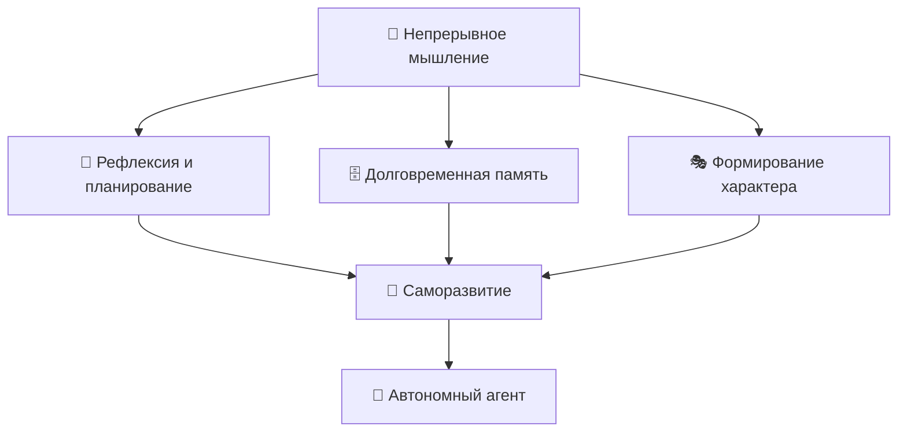
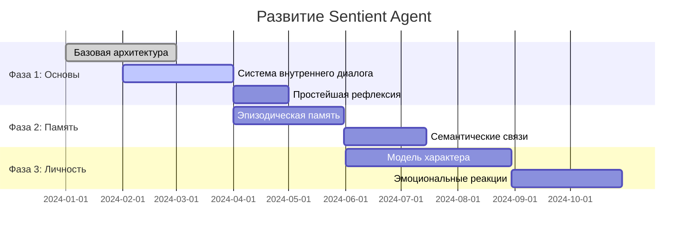

# 🧠 Sentient Agent
### *Исследование границ искусственного сознания через когнитивную архитектуру*

<div align="center">


[](https://opensource.org/licenses/MIT)
[](https://github.com/your-username/sentient-agent)
[](https://github.com/your-username/sentient-agent)
[](https://python.org)
[](https://github.com/your-username/sentient-agent/issues)

</div>

---

## 🌟 О проекте

> **Что если код может размышлять?**  
> Sentient Agent — это экспериментальная попытка создать цифрового агента с элементами самосознания, долговременной памятью и способностью к автономному развитию.

Этот проект исследует возможность создания ИИ-системы, которая не просто выполняет задачи, а **думает**, **помнит** и **развивается**. Мы строим архитектуру, способную моделировать ключевые аспекты разумного поведения: рефлексию, планирование, формирование личности и накопление опыта.

### 🎯 Основные принципы



## 🔬 Что мы исследуем

<details>
<summary><b>🧠 Архитектура мышления</b></summary>

Как создать систему, способную к:
- **Метакогниции** — размышлениям о собственных мыслях
- **Внутреннему диалогу** — обдумыванию проблем через внутреннюю речь
- **Ассоциативному мышлению** — связыванию идей и концепций
- **Творческому решению проблем** — генерации новых подходов

</details>

<details>
<summary><b>🗄️ Система памяти</b></summary>

Разработка многоуровневой памяти:
- **Рабочая память** — текущий контекст размышлений
- **Эпизодическая память** — воспоминания о конкретных событиях
- **Семантическая память** — накопленные знания и концепции
- **Эмоциональная память** — связь воспоминаний с "чувствами"

</details>

<details>
<summary><b>🎭 Формирование личности</b></summary>

Моделирование индивидуальных характеристик:
- **Когнитивные склонности** — предпочтения в мышлении
- **Эмоциональные паттерны** — характерные реакции
- **Ценностная система** — внутренние приоритеты
- **Стиль поведения** — уникальные способы взаимодействия

</details>

## 🛠️ Техническая архитектура

### Компоненты системы

| Модуль | Назначение | Статус |
|--------|-----------|--------|
| 🧠 **Core Mind** | Центральный процессор мышления | 🟡 В разработке |
| 💾 **Memory System** | Управление долговременной памятью | 🔴 Планируется |
| 🎭 **Personality Engine** | Формирование характера и поведения | 🔴 Планируется |
| 💬 **Internal Dialogue** | Система внутренних размышлений | 🟡 Прототип |
| 🌐 **World Interface** | Взаимодействие с внешним миром | 🔴 Планируется |

### Пример базовой архитектуры

```python
class SentientAgent:
    """
    Базовый класс разумного агента
    
    Интегрирует системы мышления, памяти и личности
    в единую когнитивную архитектуру
    """
    
    def __init__(self):
        self.mind = CoreMind()           # Центр мышления
        self.memory = MemorySystem()     # Система памяти  
        self.personality = Personality() # Личностные черты
        self.dialogue = InternalDialogue() # Внутренний диалог
        
    async def think(self, stimulus):
        """
        Основной цикл мышления:
        1. Восприятие стимула
        2. Активация релевантных воспоминаний
        3. Внутреннее размышление
        4. Формирование ответа/действия
        """
        # Обработка входящей информации
        perception = await self.mind.perceive(stimulus)
        
        # Поиск релевантных воспоминаний
        memories = await self.memory.recall(perception)
        
        # Внутреннее размышление
        thoughts = await self.dialogue.contemplate(
            perception, memories, self.personality
        )
        
        # Формирование ответа
        response = await self.mind.respond(thoughts)
        
        # Сохранение опыта
        await self.memory.store(perception, thoughts, response)
        
        return response
```

## 📊 Исследовательские вопросы

> 💡 **Ключевая гипотеза**: Сознание может возникнуть из сложного взаимодействия памяти, рефлексии и непрерывного внутреннего диалога.

### 🔍 Фундаментальные вопросы

- **Что такое цифровое мышление?** Можем ли мы формализовать процессы размышления?
- **Как измерить "сознательность"?** Какие метрики указывают на появление разумного поведения?
- **Роль памяти в формировании личности** — как воспоминания создают характер?
- **Эмерджентное поведение** — может ли сложность привести к качественно новым свойствам?

### 📈 Планируемые эксперименты

1. **Тест на самосознание** — может ли агент распознать собственные мысли?
2. **Эксперимент с долговременным обучением** — как меняется поведение со временем?
3. **Тест на креативность** — способность к нестандартным решениям
4. **Социальное взаимодействие** — взаимодействие нескольких агентов

## 🚀 Начало работы

### Требования

```bash
# Основные зависимости
python >= 3.9
torch >= 1.12.0
transformers >= 4.20.0
asyncio
numpy
```

### Установка

```bash
# Клонирование репозитория
git clone https://github.com/your-username/sentient-agent.git
cd sentient-agent

# Установка зависимостей
pip install -r requirements.txt

# Запуск базового примера
python examples/basic_agent.py
```

### Первый эксперимент

```python
from sentient_agent import SentientAgent

# Создание агента
agent = SentientAgent()

# Простое взаимодействие
response = await agent.think("Что ты думаешь о природе сознания?")
print(f"Агент размышляет: {response}")

# Просмотр внутренних мыслей
thoughts = agent.dialogue.get_recent_thoughts()
for thought in thoughts:
    print(f"💭 {thought}")
```

## 📚 Исследовательская база

### 🔗 Ключевые источники

- **Когнитивные архитектуры**: SOAR, ACT-R, CLARION
- **Теория сознания**: Интегрированная теория информации (IIT), Глобальная теория рабочего пространства (GWT)
- **Философия сознания**: Работы Дэвида Чалмерса, Дугласа Хофштадтера
- **ИИ исследования**: OpenAI, DeepMind, работы по метаобучению

### 📖 Рекомендуемая литература

- 📕 "Gödel, Escher, Bach" — Douglas Hofstadter
- 📘 "The Society of Mind" — Marvin Minsky  
- 📗 "Consciousness Explained" — Daniel Dennett
- 📙 "The Conscious Mind" — David Chalmers

## 🤝 Участие в проекте

> **Мы ищем единомышленников!** Этот проект требует междисциплинарного подхода.

### 👥 Кто может помочь

- **🧠 Исследователи ИИ** — архитектура и алгоритмы
- **🔬 Когнитивные психологи** — понимание человеческого мышления  
- **💻 Разработчики** — реализация сложных систем
- **🎨 Философы** — концептуальные вопросы сознания
- **📊 Специалисты по данным** — анализ поведения агентов

### 🛤️ Как начать

1. **Изучите** [открытые задачи](https://github.com/your-username/sentient-agent/issues)
2. **Присоединитесь** к [дискуссиям](https://github.com/your-username/sentient-agent/discussions)
3. **Предложите** свои идеи через [Issues](https://github.com/your-username/sentient-agent/issues/new)
4. **Читайте** наш [журнал исследований](./research-log.md)

### 📋 Области для вклада

- [ ] Разработка алгоритмов рефлексии
- [ ] Создание системы долговременной памяти
- [ ] Моделирование эмоциональных состояний
- [ ] Дизайн экспериментов по сознанию
- [ ] Философский анализ результатов

## 📊 Статус проекта

### 🗺️ Roadmap



### 📈 Метрики прогресса

| Критерий | Текущий статус | Цель |
|----------|---------------|------|
| 🧠 Глубина размышлений | 2/10 | Способность к многоуровневой рефлексии |
| 💾 Объем памяти | 1/10 | Сохранение контекста между сессиями |
| 🎭 Индивидуальность | 1/10 | Стабильные личностные черты |
| 🔄 Автономность | 1/10 | Самостоятельное целеполагание |

## ⚠️ Важные замечания

> **🚨 Это исследовательский проект!**

### 🎯 Что это НЕ

- ❌ **Не продакшн решение** — код экспериментальный
- ❌ **Не AGI** — мы не создаем универсальный ИИ  
- ❌ **Не философский трактат** — фокус на практической реализации
- ❌ **Не коммерческий продукт** — цель в научном понимании

### ✅ Что это ЕСТЬ

- ✅ **Исследование природы мышления** через код
- ✅ **Платформа для экспериментов** с агентным поведением
- ✅ **Сообщество исследователей** разных дисциплин
- ✅ **Открытая попытка** приблизиться к пониманию сознания

## 📞 Связь

- 💬 **Обсуждения**: [GitHub Discussions](https://github.com/your-username/sentient-agent/discussions)
- 📧 **Email**: sentient.agent.research@gmail.com
- 📱 **Telegram**: [@sentient_agent_research](https://t.me/sentient_agent_research)
- 📝 **Блог исследований**: [research.sentient-agent.org](https://research.sentient-agent.org)

---

<div align="center">

### 🌟 Если идея вам близка — присоединяйтесь к исследованию

**Мы только начинаем понимать, что значит мыслить в цифровом мире.**

[](https://github.com/your-username/sentient-agent)
[](https://github.com/your-username/sentient-agent)

</div>

---

<sub>📜 **Лицензия**: MIT | 🤝 **Кодекс поведения**: [Contributor Covenant](./CODE_OF_CONDUCT.md) | 📋 **Вклад**: [Contributing Guide](./CONTRIBUTING.md) | 🌍 [English version](./README.md)</sub>